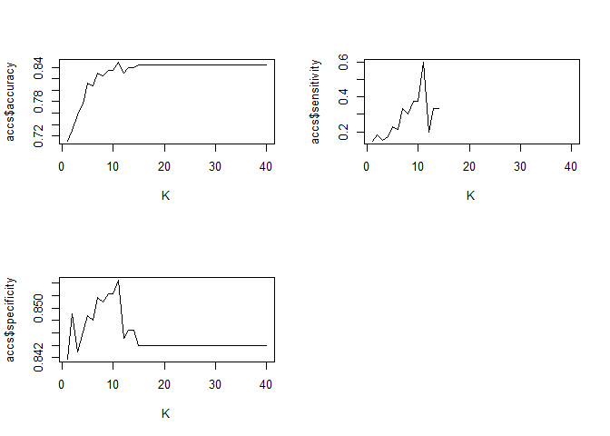
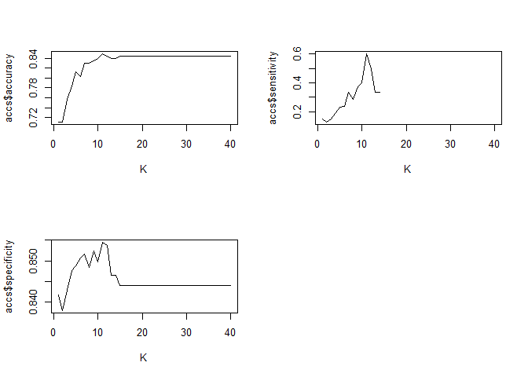

## Introduction
# The Problem Question
For this case study I was given a single data set from a fictional client and asked to look into what might cause an employee to leave a company. This term is known as attrition. The "client" asked to determine the three leading predictors of this event from their data. If a model could be created from this, could it accurately predict the event, and finally, as a side question, based on the data could a regression model be created to accurately predict the salaries of employees?

# The Process
* EDA - (Exploratory Data Analysis)
* Modeling for Attrition
* Predicting Attrition in a Test Set
* Modeling Regression for Salary
* Predicting Salary in a Test Set


# Data Import and configuration
The first task was importing the data and changing the Attrition variable to a factor from a string. This allowed for classification in the models tested later.


```r
#Base data import
base <- read.csv(curl("https://raw.githubusercontent.com/nedeinlein/CaseStudy2DDS/main/BaseData.csv"))

base$Attrition <- as.factor(base$Attrition)
df <- base
summary(df)
```

```
##        ID             Age        Attrition BusinessTravel       DailyRate     
##  Min.   :  1.0   Min.   :18.00   No :730   Length:870         Min.   : 103.0  
##  1st Qu.:218.2   1st Qu.:30.00   Yes:140   Class :character   1st Qu.: 472.5  
##  Median :435.5   Median :35.00             Mode  :character   Median : 817.5  
##  Mean   :435.5   Mean   :36.83                                Mean   : 815.2  
##  3rd Qu.:652.8   3rd Qu.:43.00                                3rd Qu.:1165.8  
##  Max.   :870.0   Max.   :60.00                                Max.   :1499.0  
##   Department        DistanceFromHome   Education     EducationField    
##  Length:870         Min.   : 1.000   Min.   :1.000   Length:870        
##  Class :character   1st Qu.: 2.000   1st Qu.:2.000   Class :character  
##  Mode  :character   Median : 7.000   Median :3.000   Mode  :character  
##                     Mean   : 9.339   Mean   :2.901                     
##                     3rd Qu.:14.000   3rd Qu.:4.000                     
##                     Max.   :29.000   Max.   :5.000                     
##  EmployeeCount EmployeeNumber   EnvironmentSatisfaction    Gender         
##  Min.   :1     Min.   :   1.0   Min.   :1.000           Length:870        
##  1st Qu.:1     1st Qu.: 477.2   1st Qu.:2.000           Class :character  
##  Median :1     Median :1039.0   Median :3.000           Mode  :character  
##  Mean   :1     Mean   :1029.8   Mean   :2.701                             
##  3rd Qu.:1     3rd Qu.:1561.5   3rd Qu.:4.000                             
##  Max.   :1     Max.   :2064.0   Max.   :4.000                             
##    HourlyRate     JobInvolvement     JobLevel       JobRole         
##  Min.   : 30.00   Min.   :1.000   Min.   :1.000   Length:870        
##  1st Qu.: 48.00   1st Qu.:2.000   1st Qu.:1.000   Class :character  
##  Median : 66.00   Median :3.000   Median :2.000   Mode  :character  
##  Mean   : 65.61   Mean   :2.723   Mean   :2.039                     
##  3rd Qu.: 83.00   3rd Qu.:3.000   3rd Qu.:3.000                     
##  Max.   :100.00   Max.   :4.000   Max.   :5.000                     
##  JobSatisfaction MaritalStatus      MonthlyIncome    MonthlyRate   
##  Min.   :1.000   Length:870         Min.   : 1081   Min.   : 2094  
##  1st Qu.:2.000   Class :character   1st Qu.: 2840   1st Qu.: 8092  
##  Median :3.000   Mode  :character   Median : 4946   Median :14074  
##  Mean   :2.709                      Mean   : 6390   Mean   :14326  
##  3rd Qu.:4.000                      3rd Qu.: 8182   3rd Qu.:20456  
##  Max.   :4.000                      Max.   :19999   Max.   :26997  
##  NumCompaniesWorked    Over18            OverTime         PercentSalaryHike
##  Min.   :0.000      Length:870         Length:870         Min.   :11.0     
##  1st Qu.:1.000      Class :character   Class :character   1st Qu.:12.0     
##  Median :2.000      Mode  :character   Mode  :character   Median :14.0     
##  Mean   :2.728                                            Mean   :15.2     
##  3rd Qu.:4.000                                            3rd Qu.:18.0     
##  Max.   :9.000                                            Max.   :25.0     
##  PerformanceRating RelationshipSatisfaction StandardHours StockOptionLevel
##  Min.   :3.000     Min.   :1.000            Min.   :80    Min.   :0.0000  
##  1st Qu.:3.000     1st Qu.:2.000            1st Qu.:80    1st Qu.:0.0000  
##  Median :3.000     Median :3.000            Median :80    Median :1.0000  
##  Mean   :3.152     Mean   :2.707            Mean   :80    Mean   :0.7839  
##  3rd Qu.:3.000     3rd Qu.:4.000            3rd Qu.:80    3rd Qu.:1.0000  
##  Max.   :4.000     Max.   :4.000            Max.   :80    Max.   :3.0000  
##  TotalWorkingYears TrainingTimesLastYear WorkLifeBalance YearsAtCompany  
##  Min.   : 0.00     Min.   :0.000         Min.   :1.000   Min.   : 0.000  
##  1st Qu.: 6.00     1st Qu.:2.000         1st Qu.:2.000   1st Qu.: 3.000  
##  Median :10.00     Median :3.000         Median :3.000   Median : 5.000  
##  Mean   :11.05     Mean   :2.832         Mean   :2.782   Mean   : 6.962  
##  3rd Qu.:15.00     3rd Qu.:3.000         3rd Qu.:3.000   3rd Qu.:10.000  
##  Max.   :40.00     Max.   :6.000         Max.   :4.000   Max.   :40.000  
##  YearsInCurrentRole YearsSinceLastPromotion YearsWithCurrManager
##  Min.   : 0.000     Min.   : 0.000          Min.   : 0.00       
##  1st Qu.: 2.000     1st Qu.: 0.000          1st Qu.: 2.00       
##  Median : 3.000     Median : 1.000          Median : 3.00       
##  Mean   : 4.205     Mean   : 2.169          Mean   : 4.14       
##  3rd Qu.: 7.000     3rd Qu.: 3.000          3rd Qu.: 7.00       
##  Max.   :18.000     Max.   :15.000          Max.   :17.00
```

## Initial EDA
Rather than typing out every combination of plot needed for the EDA of this case study, I built an app to allow me to change between plot type and variables as I needed. The App can be found at <insert app link>

## Modeling KNN (K Nearest Neighbors)
After looking at the data visually, the first model I wanted to test was a simple KNN model. KNN is a  machine learning tool that maps all the variables in the model, then uses the Euclidean (geometric) distance to determine the nearest neighbors to the point you are trying to categorize. It then uses a number, K, of these neighbors to "vote" on how a test point should be categorized. Because many of the variables did not appear to have stark differences between what could cause attrition and what would not, I worked on an original model with all continuous variables and subtracted until I came up with the final model. For this reason the initial model was used to try to find a base line K value to start with for further refining.

```r
#Set seed and building test and train data sets
set.seed(6)
splitPerc = .75
trainIndices = sample(1:dim(df)[1],round(splitPerc * dim(df)[1]))
train = df[trainIndices,]
test = df[-trainIndices,]

#finding most accurate K value for each continuous variable column (2,5,7,8,12,14,15,16,18,20,21,22,25,27,29,30,31,32,33,34,35,36)
accs = data.frame(accuracy = numeric(40), k = numeric(40))
for(i in 1:40)
{
  classifications = knn(train[,c(2,5,7,8,12,14,15,16,18,20,21,22,25,27,29,30,31,32,33,34,35,36)],test[,c(2,5,7,8,12,14,15,16,18,20,21,22,25,27,29,30,31,32,33,34,35,36)],train$Attrition, prob = TRUE, k = i)
  table(test$Attrition,classifications)
  CM = confusionMatrix(table(test$Attrition,classifications),positive = "Yes")
  accs$accuracy[i] = CM$overall[1]
  accs$sensitivity[i] = CM$byClass[1]
  accs$specificity[i] = CM$byClass[2]
  accs$k[i] = i
}

par(mfrow = c(2,2))
plot(accs$k,accs$accuracy, type = "l", xlab = "K")
plot(accs$k,accs$sensitivity, type = "l", xlab = "K")
plot(accs$k,accs$specificity, type = "l", xlab = "K")
```

<!-- -->

# Improving Accuracy
After running this, the most accurate model that the sum of the data could create with all variables was at K = 11. This put the sensitivity level at 60%, specificity at around 85%, and accuracy at 85%. To improve the model, I then started removing variables. Variables that caused a large drop in accuracy were kept, and, with each run, the model was then checked to see if the drop was due to the variable or if it was simply an issue of needing to change the K value to something other than 11.


```r
#knn with all factors at k = 11 has a max sensitivity of 60%
classifications = knn(train[,c(2,5,7,8,12,14,15,16,18,20,21,22,25,27,29,30,31,32,33,34,35,36)],test[,c(2,5,7,8,12,14,15,16,18,20,21,22,25,27,29,30,31,32,33,34,35,36)],train$Attrition, prob = TRUE, k = 11)
table(test$Attrition,classifications)
```

```
##      classifications
##        No Yes
##   No  182   2
##   Yes  31   3
```

```r
confusionMatrix(table(test$Attrition,classifications),positive = "Yes")
```

```
## Confusion Matrix and Statistics
## 
##      classifications
##        No Yes
##   No  182   2
##   Yes  31   3
##                                          
##                Accuracy : 0.8486         
##                  95% CI : (0.794, 0.8935)
##     No Information Rate : 0.9771         
##     P-Value [Acc > NIR] : 1              
##                                          
##                   Kappa : 0.1186         
##                                          
##  Mcnemar's Test P-Value : 1.093e-06      
##                                          
##             Sensitivity : 0.60000        
##             Specificity : 0.85446        
##          Pos Pred Value : 0.08824        
##          Neg Pred Value : 0.98913        
##              Prevalence : 0.02294        
##          Detection Rate : 0.01376        
##    Detection Prevalence : 0.15596        
##       Balanced Accuracy : 0.72723        
##                                          
##        'Positive' Class : Yes            
## 
```

```r
#finding most accurate K value for after dropping variables
accs = data.frame(accuracy = numeric(40), k = numeric(40))
for(i in 1:40)
{
  classifications = knn(train[,c(5,20,21)],test[,c(5,20,21)],train$Attrition, prob = TRUE, k = i)
  table(test$Attrition,classifications)
  CM = confusionMatrix(table(test$Attrition,classifications),positive = "Yes")
  accs$accuracy[i] = CM$overall[1]
  accs$sensitivity[i] = CM$byClass[1]
  accs$specificity[i] = CM$byClass[2]
  accs$k[i] = i
}

par(mfrow = c(2,2))
plot(accs$k,accs$accuracy, type = "l", xlab = "K")
plot(accs$k,accs$sensitivity, type = "l", xlab = "K")
plot(accs$k,accs$specificity, type = "l", xlab = "K")
```

<!-- -->

# Final Model KNN
After pushing through the process of adding and removing variables, I came up with the final model. The final three factors that created the most accurate model and were thus most influential to attrition in this model were DailyRate, MonthlyIncome, and MonthlyRate. However, as you can see from the statistics, this model was identical to the initial KNN model. This would indicate these are the main three factors that influenced the model. 


```r
#most accurate KNN model
classifications = knn(train[,c(5,20,21)],test[,c(5,20,21)],train$Attrition, prob = TRUE, k = 11)
table(test$Attrition,classifications)
```

```
##      classifications
##        No Yes
##   No  182   2
##   Yes  31   3
```

```r
confusionMatrix(table(test$Attrition,classifications),positive = "Yes")
```

```
## Confusion Matrix and Statistics
## 
##      classifications
##        No Yes
##   No  182   2
##   Yes  31   3
##                                          
##                Accuracy : 0.8486         
##                  95% CI : (0.794, 0.8935)
##     No Information Rate : 0.9771         
##     P-Value [Acc > NIR] : 1              
##                                          
##                   Kappa : 0.1186         
##                                          
##  Mcnemar's Test P-Value : 1.093e-06      
##                                          
##             Sensitivity : 0.60000        
##             Specificity : 0.85446        
##          Pos Pred Value : 0.08824        
##          Neg Pred Value : 0.98913        
##              Prevalence : 0.02294        
##          Detection Rate : 0.01376        
##    Detection Prevalence : 0.15596        
##       Balanced Accuracy : 0.72723        
##                                          
##        'Positive' Class : Yes            
## 
```

## NaiveBayes
While the statistics from the KNN were not completely useless, the model struggled with sensitivity. For this reason, I tested NaiveBayes as a possible alternative to the simple KNN model. NaiveBayes is a machine learning model based on a simple equation that looks at probabilities of a variable to classify an observation. This can be expanded out to many variables to create a more accurate model by adding more probabilities to the base equation. My first approach was to have all variables in a base model to get a baseline metric. I then created a model based on the strongest indicators from the KNN model to see if this would render a more accurate model than the baseline.


```r
#naiveBayes with all possible variables to use as a baseline
model = naiveBayes(Attrition ~ Age + BusinessTravel + DailyRate + Department + DistanceFromHome + Education + EducationField + EnvironmentSatisfaction + Gender + HourlyRate + JobInvolvement + JobLevel + JobRole + JobSatisfaction + MaritalStatus + MonthlyIncome + MonthlyRate + NumCompaniesWorked + OverTime + PercentSalaryHike + PerformanceRating + RelationshipSatisfaction + StandardHours + StockOptionLevel + TotalWorkingYears + TrainingTimesLastYear + WorkLifeBalance + YearsAtCompany + YearsInCurrentRole + YearsSinceLastPromotion + YearsWithCurrManager, data = train)
CM = confusionMatrix(table(predict(model,test),test$Attrition), positive = "Yes")
CM
```

```
## Confusion Matrix and Statistics
## 
##      
##        No Yes
##   No  163  14
##   Yes  21  20
##                                           
##                Accuracy : 0.8394          
##                  95% CI : (0.7839, 0.8856)
##     No Information Rate : 0.844           
##     P-Value [Acc > NIR] : 0.6178          
##                                           
##                   Kappa : 0.4374          
##                                           
##  Mcnemar's Test P-Value : 0.3105          
##                                           
##             Sensitivity : 0.58824         
##             Specificity : 0.88587         
##          Pos Pred Value : 0.48780         
##          Neg Pred Value : 0.92090         
##              Prevalence : 0.15596         
##          Detection Rate : 0.09174         
##    Detection Prevalence : 0.18807         
##       Balanced Accuracy : 0.73705         
##                                           
##        'Positive' Class : Yes             
## 
```

```r
#testing strongest indicators from KNN model
model = naiveBayes(Attrition ~ DailyRate + MonthlyIncome + MonthlyRate, data = train)
CM = confusionMatrix(table(predict(model,test),test$Attrition), positive = "Yes")
CM
```

```
## Confusion Matrix and Statistics
## 
##      
##        No Yes
##   No  184  34
##   Yes   0   0
##                                           
##                Accuracy : 0.844           
##                  95% CI : (0.7889, 0.8895)
##     No Information Rate : 0.844           
##     P-Value [Acc > NIR] : 0.5456          
##                                           
##                   Kappa : 0               
##                                           
##  Mcnemar's Test P-Value : 1.519e-08       
##                                           
##             Sensitivity : 0.000           
##             Specificity : 1.000           
##          Pos Pred Value :   NaN           
##          Neg Pred Value : 0.844           
##              Prevalence : 0.156           
##          Detection Rate : 0.000           
##    Detection Prevalence : 0.000           
##       Balanced Accuracy : 0.500           
##                                           
##        'Positive' Class : Yes             
## 
```

# Improving NaiveBayes accuracy
After running the strongest indicators from the KNN model and the sensitivity metric coming back as 0, I went back to the base model. I then removed variables and noted their change on the model. Those that, when removed, caused the metrics to decline were kept in the model. Those that, when removed, either improved the model or had no impact were removed. Through this testing the following results were found:
 
#### Top Changers of Model
 
##### Top 4 Accuracy changers
* OverTime
* JobInvolvement
* JobSatisfaction
* MaritalStatus

##### Top 4 Sensitivity Changers
* OverTime
* JobInvolvement
* MaritalStatus
* YearsInCurrentRole

##### Top 4 Sensitivity Changers
* OverTime
* JobSatisfaction
* MaritalStatus
* MonthlyRate

This testing resulted in the final model found below.

```r
#Final naiveBayes model
model = naiveBayes(Attrition ~ Age + BusinessTravel + DistanceFromHome + Education + EnvironmentSatisfaction + HourlyRate + JobInvolvement + JobLevel + JobSatisfaction + MaritalStatus + MonthlyIncome + MonthlyRate + NumCompaniesWorked + OverTime+ StockOptionLevel + TotalWorkingYears + TrainingTimesLastYear + WorkLifeBalance + YearsAtCompany + YearsInCurrentRole + YearsSinceLastPromotion + YearsWithCurrManager, data = train)
CM = confusionMatrix(table(predict(model,test),test$Attrition), positive = "Yes")
CM
```

```
## Confusion Matrix and Statistics
## 
##      
##        No Yes
##   No  175  12
##   Yes   9  22
##                                           
##                Accuracy : 0.9037          
##                  95% CI : (0.8565, 0.9394)
##     No Information Rate : 0.844           
##     P-Value [Acc > NIR] : 0.00713         
##                                           
##                   Kappa : 0.6205          
##                                           
##  Mcnemar's Test P-Value : 0.66252         
##                                           
##             Sensitivity : 0.6471          
##             Specificity : 0.9511          
##          Pos Pred Value : 0.7097          
##          Neg Pred Value : 0.9358          
##              Prevalence : 0.1560          
##          Detection Rate : 0.1009          
##    Detection Prevalence : 0.1422          
##       Balanced Accuracy : 0.7991          
##                                           
##        'Positive' Class : Yes             
## 
```

## Prediction of Attrition
When comparing the final models for both KNN and NaiveBayes, NaiveBayes was very clearly the more appropriate model for this data set. For this reason it was used to predict Attrition based on a test set supplied by the "client". Below is the code for exporting the predictions as directed. These have been uploaded to the github repository for this case study.

```r
#Final naiveBayes model - Prediction of Attrition
Case2PredictionsXXXXAttrition_raw <- read.csv('https://raw.githubusercontent.com/nedeinlein/CaseStudy2DDS/main/CaseStudy2CompSet%20No%20Attrition.csv')
model = naiveBayes(Attrition ~ Age + BusinessTravel + DistanceFromHome + Education + EnvironmentSatisfaction + HourlyRate + JobInvolvement + JobLevel + JobSatisfaction + MaritalStatus + MonthlyIncome + MonthlyRate + NumCompaniesWorked + OverTime+ StockOptionLevel + TotalWorkingYears + TrainingTimesLastYear + WorkLifeBalance + YearsAtCompany + YearsInCurrentRole + YearsSinceLastPromotion + YearsWithCurrManager, data = train)
Attrition <- predict(model,Case2PredictionsXXXXAttrition_raw)
Predictions <- cbind(Case2PredictionsXXXXAttrition_raw,Attrition) %>% select(ID,Attrition)
Predictions
```

```
##       ID Attrition
## 1   1171        No
## 2   1172        No
## 3   1173        No
## 4   1174        No
## 5   1175        No
## 6   1176        No
## 7   1177        No
## 8   1178        No
## 9   1179        No
## 10  1180        No
## 11  1181        No
## 12  1182       Yes
## 13  1183        No
## 14  1184        No
## 15  1185        No
## 16  1186        No
## 17  1187        No
## 18  1188        No
## 19  1189        No
## 20  1190        No
## 21  1191       Yes
## 22  1192        No
## 23  1193        No
## 24  1194        No
## 25  1195        No
## 26  1196        No
## 27  1197        No
## 28  1198       Yes
## 29  1199        No
## 30  1200       Yes
## 31  1201       Yes
## 32  1202        No
## 33  1203        No
## 34  1204       Yes
## 35  1205       Yes
## 36  1206        No
## 37  1207        No
## 38  1208        No
## 39  1209        No
## 40  1210        No
## 41  1211        No
## 42  1212       Yes
## 43  1213        No
## 44  1214        No
## 45  1215       Yes
## 46  1216        No
## 47  1217        No
## 48  1218        No
## 49  1219        No
## 50  1220        No
## 51  1221        No
## 52  1222        No
## 53  1223        No
## 54  1224        No
## 55  1225        No
## 56  1226        No
## 57  1227        No
## 58  1228        No
## 59  1229        No
## 60  1230        No
## 61  1231        No
## 62  1232        No
## 63  1233       Yes
## 64  1234        No
## 65  1235        No
## 66  1236        No
## 67  1237        No
## 68  1238        No
## 69  1239        No
## 70  1240        No
## 71  1241       Yes
## 72  1242        No
## 73  1243        No
## 74  1244        No
## 75  1245        No
## 76  1246       Yes
## 77  1247        No
## 78  1248        No
## 79  1249        No
## 80  1250        No
## 81  1251        No
## 82  1252        No
## 83  1253        No
## 84  1254        No
## 85  1255        No
## 86  1256        No
## 87  1257        No
## 88  1258        No
## 89  1259        No
## 90  1260       Yes
## 91  1261        No
## 92  1262        No
## 93  1263        No
## 94  1264        No
## 95  1265        No
## 96  1266        No
## 97  1267        No
## 98  1268        No
## 99  1269        No
## 100 1270       Yes
## 101 1271        No
## 102 1272        No
## 103 1273        No
## 104 1274        No
## 105 1275       Yes
## 106 1276        No
## 107 1277        No
## 108 1278        No
## 109 1279        No
## 110 1280        No
## 111 1281        No
## 112 1282        No
## 113 1283        No
## 114 1284        No
## 115 1285        No
## 116 1286        No
## 117 1287        No
## 118 1288        No
## 119 1289        No
## 120 1290        No
## 121 1291        No
## 122 1292        No
## 123 1293        No
## 124 1294        No
## 125 1295        No
## 126 1296        No
## 127 1297       Yes
## 128 1298        No
## 129 1299        No
## 130 1300        No
## 131 1301        No
## 132 1302        No
## 133 1303        No
## 134 1304       Yes
## 135 1305        No
## 136 1306        No
## 137 1307        No
## 138 1308        No
## 139 1309        No
## 140 1310       Yes
## 141 1311        No
## 142 1312        No
## 143 1313        No
## 144 1314        No
## 145 1315        No
## 146 1316        No
## 147 1317       Yes
## 148 1318       Yes
## 149 1319        No
## 150 1320        No
## 151 1321        No
## 152 1322        No
## 153 1323        No
## 154 1324        No
## 155 1325       Yes
## 156 1326        No
## 157 1327        No
## 158 1328        No
## 159 1329       Yes
## 160 1330        No
## 161 1331        No
## 162 1332        No
## 163 1333        No
## 164 1334        No
## 165 1335        No
## 166 1336       Yes
## 167 1337        No
## 168 1338        No
## 169 1339        No
## 170 1340        No
## 171 1341       Yes
## 172 1342        No
## 173 1343       Yes
## 174 1344        No
## 175 1345        No
## 176 1346        No
## 177 1347        No
## 178 1348        No
## 179 1349        No
## 180 1350        No
## 181 1351       Yes
## 182 1352        No
## 183 1353        No
## 184 1354        No
## 185 1355        No
## 186 1356        No
## 187 1357        No
## 188 1358       Yes
## 189 1359        No
## 190 1360        No
## 191 1361        No
## 192 1362        No
## 193 1363        No
## 194 1364        No
## 195 1365        No
## 196 1366        No
## 197 1367        No
## 198 1368        No
## 199 1369        No
## 200 1370        No
## 201 1371        No
## 202 1372        No
## 203 1373        No
## 204 1374        No
## 205 1375        No
## 206 1376        No
## 207 1377        No
## 208 1378        No
## 209 1379        No
## 210 1380        No
## 211 1381       Yes
## 212 1382        No
## 213 1383        No
## 214 1384        No
## 215 1385        No
## 216 1386        No
## 217 1387        No
## 218 1388        No
## 219 1389        No
## 220 1390        No
## 221 1391        No
## 222 1392        No
## 223 1393        No
## 224 1394        No
## 225 1395        No
## 226 1396        No
## 227 1397        No
## 228 1398        No
## 229 1399        No
## 230 1400        No
## 231 1401        No
## 232 1402       Yes
## 233 1403        No
## 234 1404       Yes
## 235 1405        No
## 236 1406        No
## 237 1407        No
## 238 1408        No
## 239 1409        No
## 240 1410        No
## 241 1411       Yes
## 242 1412        No
## 243 1413        No
## 244 1414        No
## 245 1415        No
## 246 1416        No
## 247 1417       Yes
## 248 1418        No
## 249 1419        No
## 250 1420        No
## 251 1421       Yes
## 252 1422        No
## 253 1423        No
## 254 1424        No
## 255 1425        No
## 256 1426        No
## 257 1427        No
## 258 1428        No
## 259 1429        No
## 260 1430        No
## 261 1431        No
## 262 1432        No
## 263 1433        No
## 264 1434        No
## 265 1435        No
## 266 1436        No
## 267 1437        No
## 268 1438        No
## 269 1439       Yes
## 270 1440        No
## 271 1441        No
## 272 1442       Yes
## 273 1443        No
## 274 1444       Yes
## 275 1445       Yes
## 276 1446        No
## 277 1447        No
## 278 1448        No
## 279 1449        No
## 280 1450       Yes
## 281 1451        No
## 282 1452        No
## 283 1453        No
## 284 1454        No
## 285 1455       Yes
## 286 1456       Yes
## 287 1457        No
## 288 1458       Yes
## 289 1459        No
## 290 1460        No
## 291 1461        No
## 292 1462        No
## 293 1463        No
## 294 1464        No
## 295 1465        No
## 296 1466        No
## 297 1467        No
## 298 1468       Yes
## 299 1469        No
## 300 1470        No
```

## Salary Regression
The second task given was to see if a regression model could be fitted to the data set to predict an employee's salary. My initial EDA into this was looking at scatter plots of the data to try to find variables, categorical and continuous, that looked like they might be correlated to MonthlyIncome. Once I had my list of variables, I ran single regression tests against each variable individually against MonthlyIncome to determine which had the strongest correlations.

```r
#Finding correlations for Salary individual regressions
fit1 <- lm(MonthlyIncome~Age, data = train)
fit2 <- lm(MonthlyIncome~Attrition, data = train)
fit3 <- lm(MonthlyIncome~JobLevel, data = train)
fit4 <- lm(MonthlyIncome~JobRole, data = train)
fit5 <- lm(MonthlyIncome~TotalWorkingYears, data = train)
fit6 <- lm(MonthlyIncome~YearsAtCompany, data = train)

#Results to put into table
sum1 <- summary(fit1)
sum2 <- summary(fit2)
sum3 <- summary(fit3)
sum4 <- summary(fit4)
sum5 <- summary(fit5)
sum6 <- summary(fit6)

variable <- c(sum1$call,sum2$call,sum3$call,sum4$call,sum5$call,sum6$call)
adj.r <-c(sum1$adj.r.squared,sum2$adj.r.squared,sum3$adj.r.squared,sum4$adj.r.squared,sum5$adj.r.squared,sum6$adj.r.squared)
results <- cbind(variable,adj.r)
results <- as.data.frame(results)
results
```

```
##                                                        variable      adj.r
## 1               lm(formula = MonthlyIncome ~ Age, data = train)  0.2357683
## 2         lm(formula = MonthlyIncome ~ Attrition, data = train) 0.01970877
## 3          lm(formula = MonthlyIncome ~ JobLevel, data = train)   0.902084
## 4           lm(formula = MonthlyIncome ~ JobRole, data = train)  0.7968753
## 5 lm(formula = MonthlyIncome ~ TotalWorkingYears, data = train)  0.5897309
## 6    lm(formula = MonthlyIncome ~ YearsAtCompany, data = train)  0.2282825
```

# Final Regression
After porting the adjusted R-Squared values into the easy to read table, I determined that JobLevel, JobRole, and TotalWorkingYears, would probably be my final model. But first, I tested to make sure that no more accurate model could be created than just using those three variables. This was done by substituting variables and removing variables, but this ended up being the final model based on the RMSE.


```r
#Final regression model
fitness <- lm(MonthlyIncome ~ JobLevel + JobRole + TotalWorkingYears, data = train)
summary(fitness)
```

```
## 
## Call:
## lm(formula = MonthlyIncome ~ JobLevel + JobRole + TotalWorkingYears, 
##     data = train)
## 
## Residuals:
##     Min      1Q  Median      3Q     Max 
## -4059.6  -689.1   -17.9   661.1  4001.8 
## 
## Coefficients:
##                               Estimate Std. Error t value Pr(>|t|)    
## (Intercept)                    -98.611    235.519  -0.419  0.67558    
## JobLevel                      2808.507     94.686  29.661  < 2e-16 ***
## JobRoleHuman Resources         -91.215    307.717  -0.296  0.76700    
## JobRoleLaboratory Technician  -598.191    192.951  -3.100  0.00202 ** 
## JobRoleManager                3962.954    255.134  15.533  < 2e-16 ***
## JobRoleManufacturing Director   53.760    196.654   0.273  0.78466    
## JobRoleResearch Director      3773.970    250.368  15.074  < 2e-16 ***
## JobRoleResearch Scientist     -285.595    196.962  -1.450  0.14755    
## JobRoleSales Executive         -76.091    163.655  -0.465  0.64213    
## JobRoleSales Representative   -431.599    248.427  -1.737  0.08281 .  
## TotalWorkingYears               47.989      9.182   5.227 2.34e-07 ***
## ---
## Signif. codes:  0 '***' 0.001 '**' 0.01 '*' 0.05 '.' 0.1 ' ' 1
## 
## Residual standard error: 1068 on 641 degrees of freedom
## Multiple R-squared:  0.9451,	Adjusted R-squared:  0.9442 
## F-statistic:  1103 on 10 and 641 DF,  p-value: < 2.2e-16
```

```r
pred <- predict(fitness, newdata = test)
rmse(test$MonthlyIncome, pred)
```

```
## [1] 1056.396
```

# Prediction of Salary
The above model was then used on a test date set supplied by the "client" to predict salary. Below is the code that was used to run the prediction and then export the data in the appropriate format for submission.

```r
#Regression prediction
Case2PredictionsXXXXSalary_raw <- read.csv('https://raw.githubusercontent.com/nedeinlein/CaseStudy2DDS/main/CaseStudy2CompSet%20No%20Salary.csv')
fitness<- lm(MonthlyIncome ~ JobLevel + JobRole + TotalWorkingYears, data = train)
MonthlyIncome<- predict(fitness,Case2PredictionsXXXXSalary_raw)
Predictionsalary <- cbind(Case2PredictionsXXXXSalary_raw,MonthlyIncome) %>% select(ID,MonthlyIncome)
Predictionsalary
```

```
##       ID MonthlyIncome
## 1    871      5778.236
## 2    872      2664.246
## 3    873     12211.066
## 4    874      2351.651
## 5    875      2447.629
## 6    876      5998.597
## 7    877      5826.225
## 8    878      2207.683
## 9    879      2904.192
## 10   880     12580.862
## 11   881      9594.515
## 12   882      2447.629
## 13   883      5730.247
## 14   884      5682.258
## 15   885      5922.204
## 16   886      5764.119
## 17   887      6046.283
## 18   888      5908.087
## 19   889      5400.104
## 20   890      2906.615
## 21   891      5664.710
## 22   892      8682.722
## 23   893      8682.722
## 24   894      5730.247
## 25   895      9718.595
## 26   896      8956.540
## 27   897      8778.700
## 28   898     16106.144
## 29   899      5922.204
## 30   900      2712.235
## 31   901      2399.640
## 32   902      5970.193
## 33   903      6306.116
## 34   904      2495.618
## 35   905     16346.089
## 36   906      5634.269
## 37   907      9334.682
## 38   908      5956.076
## 39   909      2207.683
## 40   910      2472.290
## 41   911     18917.624
## 42   912      2954.605
## 43   913      2447.629
## 44   914     12961.713
## 45   915      5956.076
## 46   916      5160.158
## 47   917      2568.268
## 48   918      5682.258
## 49   919      2326.286
## 50   920      2687.575
## 51   921      2470.253
## 52   922      2159.694
## 53   923      5352.115
## 54   924      5907.079
## 55   925     16825.980
## 56   926      2591.596
## 57   927      5922.204
## 58   928     13060.663
## 59   929      2159.694
## 60   930      2495.618
## 61   931      6162.149
## 62   932     12580.772
## 63   933      8730.711
## 64   934      2255.673
## 65   935      2159.694
## 66   936      2303.662
## 67   937      9142.725
## 68   938      9244.474
## 69   939      6096.612
## 70   940      2326.286
## 71   941      2831.542
## 72   942      8778.700
## 73   943      9594.515
## 74   944      5764.119
## 75   945      2278.297
## 76   946      5806.338
## 77   947      2326.286
## 78   948      2568.268
## 79   949      3002.594
## 80   950      5826.225
## 81   951      2904.192
## 82   952      5826.225
## 83   953      5902.316
## 84   954      2399.640
## 85   955      5352.115
## 86   956      8667.598
## 87   957     10156.267
## 88   958      2591.596
## 89   959      9258.591
## 90   960     19637.460
## 91   961      2712.235
## 92   962      5664.710
## 93   963      6142.262
## 94   964      6003.057
## 95   965      2520.279
## 96   966     19109.580
## 97   967      2664.246
## 98   968      8730.711
## 99   969     16634.024
## 100  970      2351.651
## 101  971      5778.236
## 102  972      5998.294
## 103  973      2351.651
## 104  974      2472.290
## 105  975      5812.108
## 106  976      2616.257
## 107  977      6430.196
## 108  978      2712.235
## 109  979      9196.485
## 110  980     19010.629
## 111  981      2566.231
## 112  982      8970.657
## 113  983      2399.640
## 114  984      2518.242
## 115  985      5826.225
## 116  986      2808.214
## 117  987      2472.290
## 118  988      5778.236
## 119  989      9388.441
## 120  990      2568.268
## 121  991      6051.047
## 122  992      2664.246
## 123  993      6003.057
## 124  994      5682.258
## 125  995      5730.247
## 126  996      6000.634
## 127  997      2568.268
## 128  998     16301.073
## 129  999      8826.689
## 130 1000      2159.694
## 131 1001      6195.014
## 132 1002      5326.749
## 133 1003      5712.699
## 134 1004      6531.945
## 135 1005      2904.192
## 136 1006      5874.215
## 137 1007      2374.275
## 138 1008      5998.294
## 139 1009     19154.597
## 140 1010      5710.662
## 141 1011      9196.485
## 142 1012      5808.677
## 143 1013      6066.171
## 144 1014      5448.093
## 145 1015      5874.215
## 146 1016      2495.618
## 147 1017      2591.596
## 148 1018      8730.711
## 149 1019      8826.689
## 150 1020      2424.301
## 151 1021      5874.215
## 152 1022      5778.236
## 153 1023      5568.732
## 154 1024      9526.638
## 155 1025     16106.144
## 156 1026     18914.651
## 157 1027      5859.090
## 158 1028      5682.258
## 159 1029      5634.269
## 160 1030      9387.434
## 161 1031      5634.269
## 162 1032      3098.572
## 163 1033     12532.783
## 164 1034      2472.290
## 165 1035      5448.093
## 166 1036      2472.290
## 167 1037      5730.247
## 168 1038      9003.521
## 169 1039     12532.783
## 170 1040      6046.283
## 171 1041      2399.640
## 172 1042      2712.235
## 173 1043      8730.711
## 174 1044      6306.116
## 175 1045      2664.246
## 176 1046      2159.694
## 177 1047      5908.087
## 178 1048     12865.734
## 179 1049      2808.214
## 180 1050      5778.236
## 181 1051     10012.300
## 182 1052      2495.618
## 183 1053      5902.316
## 184 1054      2712.235
## 185 1055      2712.235
## 186 1056      2399.640
## 187 1057      5860.097
## 188 1058     16154.133
## 189 1059      6338.981
## 190 1060      2712.235
## 191 1061      5856.666
## 192 1062      6004.065
## 193 1063      6238.240
## 194 1064      2422.264
## 195 1065      6094.273
## 196 1066      2351.651
## 197 1067      3384.083
## 198 1068     19490.520
## 199 1069      5682.258
## 200 1070      2470.253
## 201 1071      2518.242
## 202 1072      6196.021
## 203 1073      2374.275
## 204 1074      5998.294
## 205 1075      5730.247
## 206 1076     16442.067
## 207 1077     19154.597
## 208 1078      5400.104
## 209 1079      5712.699
## 210 1080      6144.601
## 211 1081      2808.214
## 212 1082      2616.257
## 213 1083      2326.286
## 214 1084      6162.149
## 215 1085      8860.561
## 216 1086      9210.602
## 217 1087      5730.247
## 218 1088      2712.235
## 219 1089      2712.235
## 220 1090      5730.247
## 221 1091      5778.236
## 222 1092      6162.149
## 223 1093     12580.772
## 224 1094      5778.236
## 225 1095      5806.338
## 226 1096      5956.076
## 227 1097      3240.116
## 228 1098      2906.615
## 229 1099      2495.618
## 230 1100      6052.054
## 231 1101     18914.651
## 232 1102      5826.225
## 233 1103      6066.171
## 234 1104      9930.439
## 235 1105      2808.214
## 236 1106      2808.214
## 237 1107      2856.203
## 238 1108      5907.079
## 239 1109      5778.236
## 240 1110      5730.247
## 241 1111      6238.240
## 242 1112     12961.713
## 243 1113     13009.702
## 244 1114      6306.116
## 245 1115      9526.638
## 246 1116      2808.214
## 247 1117      6435.967
## 248 1118      5400.104
## 249 1119      9478.649
## 250 1120      2662.209
## 251 1121      9210.602
## 252 1122     16394.078
## 253 1123      5712.699
## 254 1124     16154.133
## 255 1125      2520.279
## 256 1126      2326.286
## 257 1127      2399.640
## 258 1128      5352.115
## 259 1129     16154.133
## 260 1130      2303.662
## 261 1131     12532.783
## 262 1132     16106.144
## 263 1133      5998.294
## 264 1134      2303.662
## 265 1135      2591.596
## 266 1136      2399.640
## 267 1137      2927.520
## 268 1138      5922.204
## 269 1139      9066.635
## 270 1140     15581.236
## 271 1141      5998.294
## 272 1142      5922.204
## 273 1143      9622.617
## 274 1144      5634.269
## 275 1145      6099.036
## 276 1146      5826.225
## 277 1147      5208.147
## 278 1148      2303.662
## 279 1149      2568.268
## 280 1150      6046.283
## 281 1151      2616.257
## 282 1152      5826.225
## 283 1153      6192.590
## 284 1154      2159.694
## 285 1155      6339.989
## 286 1156     12143.189
## 287 1157      2518.242
## 288 1158      5952.645
## 289 1159      2616.257
## 290 1160      5908.087
## 291 1161      2712.235
## 292 1162      8860.561
## 293 1163      2639.585
## 294 1164      8956.540
## 295 1165      2808.214
## 296 1166      2207.683
## 297 1167      8998.758
## 298 1168      5730.247
## 299 1169      2712.235
## 300 1170      2808.214
```

## Thank you for your review of this project.
Nathan Deinlein
